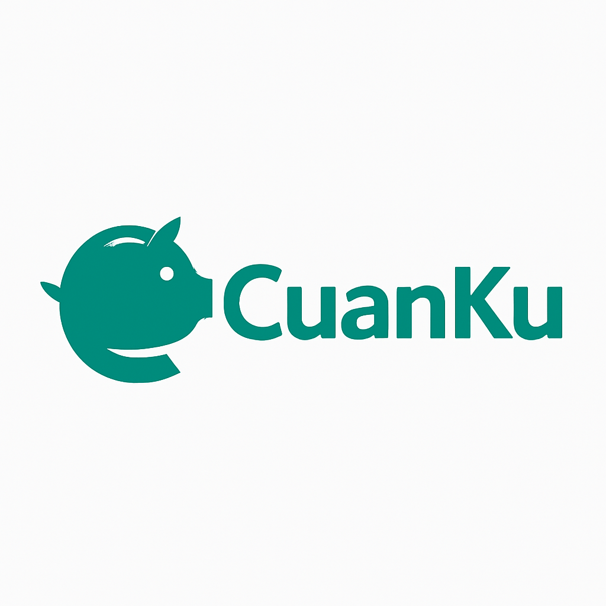

<!-- PROJECT LOGO -->
<br />
<div align="center">
  <a href="https://github.com/titanioy/cuanku">
    
  </a>

  <h3 align="center">CuanKu</h3>

  <p align="center">
    Smart Personal Finance Management Platform
    <br />
    <a href="https://github.com/titanioy/cuanku"><strong>Explore the docs »</strong></a>
    <br />
    <br />
    <a href="https://cuanku.web.id">View Demo</a>
    ·
    <a href="https://github.com/titanioy/cuanku/issues">Report Bug</a>
    ·
    <a href="https://github.com/titanioy/cuanku/issues">Request Feature</a>
  </p>
</div>

<!-- TABLE OF CONTENTS -->
<details>
  <summary>Table of Contents</summary>
  <ol>
    <li>
      <a href="#about-the-project">About The Project</a>
      <ul>
        <li><a href="#built-with">Built With</a></li>
      </ul>
    </li>
    <li>
      <a href="#getting-started">Getting Started</a>
      <ul>
        <li><a href="#prerequisites">Prerequisites</a></li>
        <li><a href="#installation">Installation</a></li>
      </ul>
    </li>
    <li><a href="#usage">Usage</a></li>
    <li><a href="#features">Features</a></li>
    <li><a href="#roadmap">Roadmap</a></li>
    <li><a href="#contributing">Contributing</a></li>
    <li><a href="#license">License</a></li>
    <li><a href="#contact">Contact</a></li>
  </ol>
</details>

<!-- ABOUT THE PROJECT -->

## About The Project

[![CuanKu Screen Shot][product-screenshot]](https://github.com/titanioy/cuanku)

CuanKu is a comprehensive personal finance management platform designed to help individuals take control of their financial lives. With intelligent features and an intuitive interface, CuanKu empowers users to track expenses, manage budgets, set financial goals, and make informed financial decisions.

### Key Highlights:

- 🎯 **Smart Budget Management** - Create and track budgets with real-time monitoring
- 📊 **Expense Tracking** - Categorize and analyze your spending patterns
- 🎯 **Goal Setting** - Set and achieve your financial objectives
- 📈 **Net Worth Tracking** - Monitor your assets and liabilities
- 💰 **Savings Reminders** - Automated notifications to encourage regular saving habits
- 🤖 **AI-Powered Insights** - Get personalized financial recommendations powered by n8n automation
- 📧 **Automated Reports** - Monthly/yearly financial summaries sent via intelligent workflows
- 📱 **Modern UI/UX** - Beautiful and responsive design across all devices
- 🔧 **Admin Dashboard** - Elegant admin panel built with Filament for user management
- 🔍 **Error Monitoring** - Real-time error tracking and performance monitoring with Sentry

<p align="right">(<a href="#readme-top">back to top</a>)</p>

### Built With

This project is built using modern web technologies:

- [![Laravel][Laravel.com]][Laravel-url]
- [![React][React.js]][React-url]
- [![Inertia.js][Inertia.js]][Inertia-url]
- [![Tailwind CSS][TailwindCSS]][Tailwind-url]
- [![Shadcn/ui][Shadcn]][Shadcn-url]
- [![Filament][Filament]][Filament-url]
- [![MySQL][MySQL]][MySQL-url]
- [![MongoDB][MongoDB]][MongoDB-url]
- [![n8n][n8n]][n8n-url]
- [![Metabase][Metabase]][Metabase-url]
- [![Sentry][Sentry]][Sentry-url]

<p align="right">(<a href="#readme-top">back to top</a>)</p>

<!-- GETTING STARTED -->

## Getting Started

To get a local copy up and running follow these simple steps.

### Prerequisites

Make sure you have the following installed:

- PHP >= 8.1
- Composer
- Node.js >= 16
- MySQL >= 8.0
- MongoDB >= 6.0
- n8n (for AI automation workflows)
- Metabase (for business analytics)
- Filament (for admin dashboard)
- Sentry (for error tracking and monitoring)
- Git

### Installation

1. Clone the repository

    ```sh
    git clone https://github.com/titanioy/cuanku.git
    ```

2. Navigate to the project directory

    ```sh
    cd cuanku
    ```

3. Install PHP dependencies

    ```sh
    composer install
    ```

4. Install NPM packages

    ```sh
    npm install
    ```

5. Copy the environment file

    ```sh
    cp .env.example .env
    ```

6. Generate application key

    ```sh
    php artisan key:generate
    ```

7. Configure your database in `.env` file

    ```
    DB_CONNECTION=mysql
    DB_HOST=127.0.0.1
    DB_PORT=3306
    DB_DATABASE=cuanku
    DB_USERNAME=your_username
    DB_PASSWORD=your_password

    # Sentry Configuration (optional)
    SENTRY_LARAVEL_DSN=your_sentry_dsn_here
    SENTRY_TRACES_SAMPLE_RATE=1.0
    ```

8. Run database migrations

    ```sh
    php artisan migrate
    ```

9. Seed the database (optional)

    ```sh
    php artisan db:seed
    ```

10. Build frontend assets

    ```sh
    npm run build
    ```

11. Start the development server

    ```sh
    php artisan serve
    ```

12. Configure Sentry for error tracking (optional)
    - Sign up for a free account at [Sentry.io](https://sentry.io/)
    - Create a new Laravel project
    - Copy your DSN and add it to your `.env` file
    - Install Sentry SDK:
    ```sh
    composer require sentry/sentry-laravel
    ```

<p align="right">(<a href="#readme-top">back to top</a>)</p>

<!-- USAGE EXAMPLES -->

## Usage

### Dashboard Overview

Access your financial overview with real-time data visualization including:

- Monthly income vs expenses
- Budget performance
- Goal progress tracking
- Net worth evolution

### Budget Management

- Create monthly budgets by category
- Track spending against budget limits
- Receive alerts when approaching limits
- Analyze budget performance over time

### Expense Tracking

- Log expenses with detailed categorization
- Upload receipts and notes
- Generate expense reports
- Identify spending patterns

### Financial Goals

- Set short-term and long-term financial goals
- Track progress with visual indicators
- Receive milestone notifications
- Adjust goals as needed

### Business Analytics Dashboard (Metabase)

- Access comprehensive business intelligence dashboards
- Monitor user engagement and platform performance
- Analyze financial trends and user behavior patterns
- Generate custom reports for stakeholder insights
- Real-time metrics visualization for business decisions

### Admin Dashboard (Filament)

- Access admin panel at `/admin` route
- Manage user accounts and permissions
- View user statistics and activity
- Clean and intuitive interface for user management
- Built with Filament for Laravel administration

### Annual Reports & PDF Export

- Generate comprehensive annual financial reports
- Download reports in PDF format with professional styling
- Include monthly breakdowns for all financial categories
- Automated calculations for planned vs actual comparisons
- Shareable reports for financial planning and analysis
- **Indonesia timezone support** - All timestamps show WIB (Waktu Indonesia Barat)
- **Indonesian date formatting** - Dates displayed in Indonesian language (Juli, Agustus, etc.)

_For more examples, please refer to the [Documentation](https://github.com/titanioy/cuanku/wiki)_

<p align="right">(<a href="#readme-top">back to top</a>)</p>

<!-- FEATURES -->

## Features

- [x] User Authentication & Authorization
- [x] Budget Creation & Management
- [x] Expense & Income Tracking
- [x] Financial Goal Setting
- [x] Net Worth Calculation
- [x] Dashboard Analytics
- [x] Monthly/Yearly Financial Reports
- [x] PDF Export for Annual Reports
- [x] Admin Panel (Filament)
- [x] Responsive Design
- [x] AI-Powered Financial Insights
- [x] Business Analytics Dashboard (Metabase)
- [ ] Mobile App
- [ ] Bank Integration
- [ ] Investment Tracking
- [ ] Bill Reminders

<p align="right">(<a href="#readme-top">back to top</a>)</p>

<!-- ROADMAP -->

## Roadmap

- [ ] Add mobile application
- [x] Implement AI-powered financial advisor
- [ ] Add bank account integration
- [ ] Multi-language Support
- [ ] Investment portfolio tracking
- [ ] Automated bill reminders
- [ ] Financial planning tools

See the [open issues](https://github.com/titanioy/cuanku/issues) for a full list of proposed features (and known issues).

<p align="right">(<a href="#readme-top">back to top</a>)</p>

<!-- CONTRIBUTING -->

## Contributing

Contributions are what make the open source community such an amazing place to learn, inspire, and create. Any contributions you make are **greatly appreciated**.

If you have a suggestion that would make this better, please fork the repo and create a pull request. You can also simply open an issue with the tag "enhancement".
Don't forget to give the project a star! Thanks again!

1. Fork the Project
2. Create your Feature Branch (`git checkout -b feat/AmazingFeature`)
3. Commit your Changes (`git commit -m 'feat: Add some AmazingFeature'`)
4. Push to the Branch (`git push origin feat/AmazingFeature`)
5. Open a Pull Request

<p align="right">(<a href="#readme-top">back to top</a>)</p>

<!-- LICENSE -->

## License

Distributed under the MIT License. See `LICENSE.txt` for more information.

<p align="right">(<a href="#readme-top">back to top</a>)</p>

<!-- CONTACT -->

## Contact

Titanio Yudista - titanio.yudista@cakrawala.ac.id

Project Link: [https://github.com/titanioy/cuanku](https://github.com/titanioy/cuanku)

<p align="right">(<a href="#readme-top">back to top</a>)</p>

<!-- MARKDOWN LINKS & IMAGES -->
<!-- https://www.markdownguide.org/basic-syntax/#reference-style-links -->

[product-screenshot]: public/images/cuanku.png
[Laravel.com]: https://img.shields.io/badge/Laravel-FF2D20?style=for-the-badge&logo=laravel&logoColor=white
[Laravel-url]: https://laravel.com
[React.js]: https://img.shields.io/badge/React-20232A?style=for-the-badge&logo=react&logoColor=61DAFB
[React-url]: https://reactjs.org/
[Inertia.js]: https://img.shields.io/badge/Inertia.js-9553E9?style=for-the-badge&logo=inertia&logoColor=white
[Inertia-url]: https://inertiajs.com/
[TailwindCSS]: https://img.shields.io/badge/Tailwind_CSS-38B2AC?style=for-the-badge&logo=tailwind-css&logoColor=white
[Tailwind-url]: https://tailwindcss.com/
[Shadcn]: https://img.shields.io/badge/shadcn%2Fui-000000?style=for-the-badge&logo=shadcnui&logoColor=white
[Shadcn-url]: https://ui.shadcn.com/
[Filament]: https://img.shields.io/badge/Filament-FDAE4B?style=for-the-badge&logo=data:image/svg+xml;base64,PHN2ZyB3aWR0aD0iNDAiIGhlaWdodD0iNDAiIHZpZXdCb3g9IjAgMCA0MCA0MCIgZmlsbD0ibm9uZSIgeG1sbnM9Imh0dHA6Ly93d3cudzMub3JnLzIwMDAvc3ZnIj4KPHBhdGggZD0iTTIwIDQwQzMxLjA0NTcgNDAgNDAgMzEuMDQ1NyA0MCAyMEM0MCA4Ljk1NDMgMzEuMDQ1NyAwIDIwIDBDOC45NTQzIDAgMCA4Ljk1NDMgMCAyMEMwIDMxLjA0NTcgOC45NTQzIDQwIDIwIDQwWiIgZmlsbD0iIzAwMCIvPgo8cGF0aCBkPSJNMjAgMzJDMjYuNjI3NCAzMiAzMiAyNi42Mjc0IDMyIDIwQzMyIDEzLjM3MjYgMjYuNjI3NCA4IDIwIDhDMTMuMzcyNiA4IDggMTMuMzcyNiA4IDIwQzggMjYuNjI3NCAxMy4zNzI2IDMyIDIwIDMyWiIgZmlsbD0iI0ZEQUU0QiIvPgo8L3N2Zz4K&logoColor=white
[Filament-url]: https://filamentphp.com/
[MySQL]: https://img.shields.io/badge/MySQL-005C84?style=for-the-badge&logo=mysql&logoColor=white
[MySQL-url]: https://mysql.com/
[MongoDB]: https://img.shields.io/badge/MongoDB-4EA94B?style=for-the-badge&logo=mongodb&logoColor=white
[MongoDB-url]: https://mongodb.com/
[n8n]: https://img.shields.io/badge/n8n-EA4B71?style=for-the-badge&logo=n8n&logoColor=white
[n8n-url]: https://n8n.io/
[Metabase]: https://img.shields.io/badge/Metabase-509EE3?style=for-the-badge&logo=metabase&logoColor=white
[Metabase-url]: https://metabase.com/
[Sentry]: https://img.shields.io/badge/Sentry-362D59?style=for-the-badge&logo=sentry&logoColor=white
[Sentry-url]: https://sentry.io/
